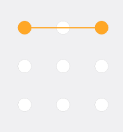
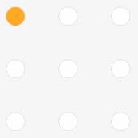

## 360H5

**demo地址：[http://fuch.cn/GesturePassword/](http://fuch.cn/GesturePassword/)**

### 飞跃太空山问题

**2017.03.28**

飞跃太空山问题：  
当我如同蜘蛛侠一般从一个点上空飞过，  
  
降落到另一个点  
  
也可以称为**隔山打牛**  

一开始我在开发时认为这个并不是问题，因为我印象中手机的解锁也是支持这个技能的，我也没去验证。但是今天舍友[@Nightwingky](https://github.com/Nightwingky)非常严肃的和我说这确实是个bug，并且在这种情况下，手机系统的手势解锁都会将中间的那一点连起来。  

既然是这样，那我就必须要把这个bug给搞定了。  

我的思路是这样的：  
**给圆点再添加一个事件，当有一条直线经过它时，给它加特效（变色、标记已经经过、存储code...）**。  

我之前设想的解决方案是这样的：  
**判断一条路径是否经过某个圆**，现有的解决方法有：
1. 线段和圆心的距离是否小于半径
2. 用isPointInPath()方法判断圆是否在路径上（只能判断一个点是否经过圆，无法判断一条路径是否经过圆）
3. 只判断圆心是否在路径上就好了。

最后我采用了第3中方案，**判断圆心是否在路径的线段上**。  

效果图：  
  

### 事件委托

用委托，canvas中的图形事件委托给canvas。

#### 在Ball类中添加事件

**触碰到小球事件：**
1. **先判断小球是否已经经过**（通过存储的code判断）
1. **先将之前的线段固定**
1. 添加isInPath来判断是否点击到了小球
2. isInPath需要ctx来支持，而参数中有ctx
3. 接下来就只要通过点击获取坐标就好了。
4. 再存储小球的code
5. **设置线的新起点**

**滑动事件：**
1. 只需要每次都根据手一动的位置重新画线就好了。
2. **那原来那条线怎么删掉呢？**
3. **还是说没移动一次都将所有小球都重新画，然后将原来画的那条线用背景色再画一遍？**

**手抬起事件：**
1. 原本我们不是重新画了条线吗？这时候我们必须把原来这条线删除掉
2. 原理和滑动事件是一样的。

> 参考[如何为Canvas中特定图形绑定事件？](http://www.tuicool.com/articles/ZNrMfmU)
> **但参考的资料中有点问题**
> 链接中判断触点是否经过某圆的方法是使用Canvas内置的isPointInPath()，但这有个缺陷，就是在**每次判断时都必须要将路径重新设定一遍**，如果想边画线边判断，这就会导致错误。
> 因此我自己用了一个更靠谱的方法，**判断和圆心的距离**，如果小于等于半径则说明在圆内（高中数学终于没白学）。
